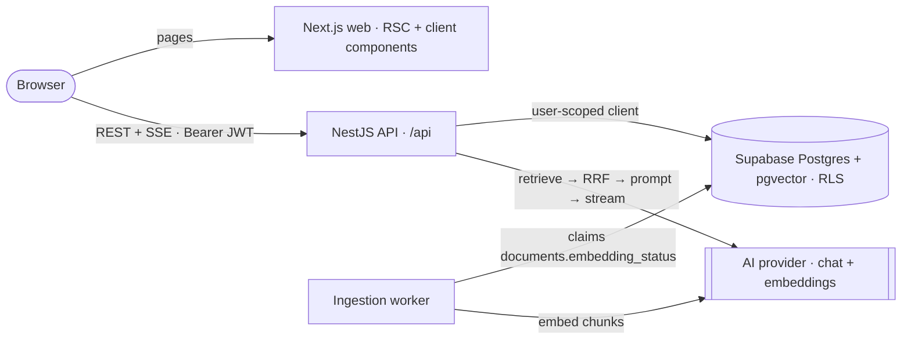

# AI Knowledge Base

Keep your documents in one place and chat with them. Answers are grounded in your own notes through retrieval-augmented generation (RAG), stream in token by token and cite the passages they came from.

**Stack:** Turborepo · Next.js 16 · NestJS 12 · Supabase (Postgres, pgvector, Auth) · a provider-agnostic AI layer (OpenAI by default).

## What it is

- **Documents** — write Markdown or upload `.txt`, `.md` and `.pdf` files, tag them and watch them get indexed.
- **Chat** — ask across every document or a selected subset; answers stream in with `[n]` citations that open the source passage.
- **History and usage** — conversations persist, and a usage view shows token counts per day and per model.

## Demo videos

- App walkthrough — _link added once recorded_
- How AI accelerated the build — _link added once recorded_

## Quick start

Prerequisites: Node.js ≥ 22.22 (`nvm install 22`), pnpm ≥ 10 (Corepack picks the pinned version) and, for the local database mode, Docker Desktop.

```bash
git clone <repository-url> ai-knowledge-base
cd ai-knowledge-base
corepack enable pnpm
pnpm bootstrap   # choose: 1) local Supabase (Docker)  2) hosted Supabase project  3) skip the database
```

Add your OpenAI key to the root `.env`, then start both apps:

```bash
echo 'AI_CHAT_API_KEY=sk-...' >> .env
pnpm dev         # web → http://localhost:3000 · API → http://localhost:4000/api/health
```

- Non-interactive: `pnpm bootstrap --local`, `pnpm bootstrap --hosted` or `pnpm bootstrap --skip-db` (prints how to apply `supabase/migrations/*.sql` in the Supabase SQL editor).
- Re-running `pnpm bootstrap` is safe: it never overwrites an existing `.env` (unless you pass `--force-env`).
- Hosted projects: disable **Confirm email** under Authentication → Providers, or confirm each sign-up through the emailed link.

## Architecture



The browser talks to the API directly with the user's Supabase access token, so every query runs under row-level security. Answers stream back as Server-Sent Events with citations attached.

## Monorepo layout

| Path                         | Package                 | Responsibility                                                       |
| ---------------------------- | ----------------------- | -------------------------------------------------------------------- |
| `apps/web`                   | `web`                   | Next.js 16 App Router UI                                             |
| `apps/api`                   | `api`                   | NestJS 12 REST + SSE API and the ingestion worker                    |
| `packages/contracts`         | `@kb/contracts`         | zod DTOs, API routes, SSE events, limits, error codes                |
| `packages/ai`                | `@kb/ai`                | Provider-agnostic chat and embedding layer                           |
| `packages/ui`                | `@kb/ui`                | React primitives and Tailwind v4 theme tokens                        |
| `packages/eslint-config`     | `@kb/eslint-config`     | ESLint 10 flat configs (base, library, react, next, nest)            |
| `packages/typescript-config` | `@kb/typescript-config` | tsconfig presets (base, nestjs, nextjs, react-library, node-library) |
| `supabase`                   | —                       | Local stack config and SQL migrations                                |

## Decisions & why

Every significant choice is recorded in [`DECISIONS.md`](./DECISIONS.md), including: zod contracts as the single source of truth (DEC-002), RLS as the security boundary (DEC-004), the Postgres status column as the ingestion queue (DEC-005), hybrid retrieval with RRF (DEC-007) and SSE over POST (DEC-008).

## RAG design

- **Chunking** — markdown-aware, 400-token target / 512 max / 50 overlap, a `Title › Heading` breadcrumb per chunk, content-hash keys so re-indexing only embeds what changed.
- **Retrieval** — vector and full-text search in parallel, fused with Reciprocal Rank Fusion (k = 60), top 6 into the prompt; optional document scope.
- **Prompt** — numbered sources within a token budget, trimmed history, and instructions to answer only from the sources and cite with `[n]`.
- **Query rewrite** — follow-ups are condensed into a standalone query (skipped on the first turn) at the cost of one small extra model call.

## Provider-agnostic AI layer

Application code depends on `ChatModel` and `EmbeddingModel` ports from `@kb/ai`; one OpenAI-compatible adapter serves every supported provider.

### How to swap providers

Only environment variables change; chat and embeddings are configured independently.

| Profile      | Chat | Embeddings | Notes                                            |
| ------------ | ---- | ---------- | ------------------------------------------------ |
| `openai`     | ✓    | ✓          | Default                                          |
| `groq`       | ✓    | —          | Pair with another embedding provider             |
| `together`   | ✓    | ✓          | 768-dimension embeddings are zero-padded         |
| `openrouter` | ✓    | ✓          | Sends attribution headers from `AI_APP_*`        |
| `ollama`     | ✓    | ✓          | Fully local; no API key                          |
| `custom`     | ✓    | ✓          | Any OpenAI-compatible base URL (LM Studio, vLLM) |

```bash
# Groq for chat, OpenAI for embeddings
AI_CHAT_PROVIDER=groq AI_CHAT_MODEL=llama-3.3-70b-versatile AI_EMBEDDING_PROVIDER=openai AI_EMBEDDING_API_KEY=sk-...
# Fully local with Ollama
AI_CHAT_PROVIDER=ollama AI_CHAT_MODEL=llama3.2 AI_EMBEDDING_PROVIDER=ollama AI_EMBEDDING_MODEL=nomic-embed-text
```

Changing the embedding model re-queues existing documents automatically; models above 1536 dimensions need a column migration (DEC-014).

## Security

- Row-level security on every table; the API queries Supabase with the caller's token, never a shared admin client.
- The secret key is confined to the ingestion worker and usage recorder; column privileges keep ingestion bookkeeping out of users' reach.
- JWTs are verified against Supabase's signing keys; CORS allows only the web origin.
- Per-user rate limits (stricter for chat, uploads and re-indexing) and size limits on documents, messages and uploads.

## Testing

`pnpm check` runs the full gate: format, lint, typecheck, unit tests and build — the same steps as CI. Unit tests (Vitest) live in each package's `__tests__/unit/` and cover contracts, the AI layer, chunking, ranking, prompt building, SSE parsing and the other pure logic. External boundaries (AI provider, database) use in-memory fakes, so tests need no keys or network.

## What I'd improve

- Playwright smoke tests for the main flows.
- Run the ingestion worker as its own process, or move to pg-boss.
- A cross-encoder reranker after fusion, and a semantic answer cache.
- Per-user token budgets; Redis storage for the rate limiter.
- Docker Compose for the API, remote Turborepo caching, API versioning and more UI locales.

## How AI accelerated the build

_To be written with the second video._
