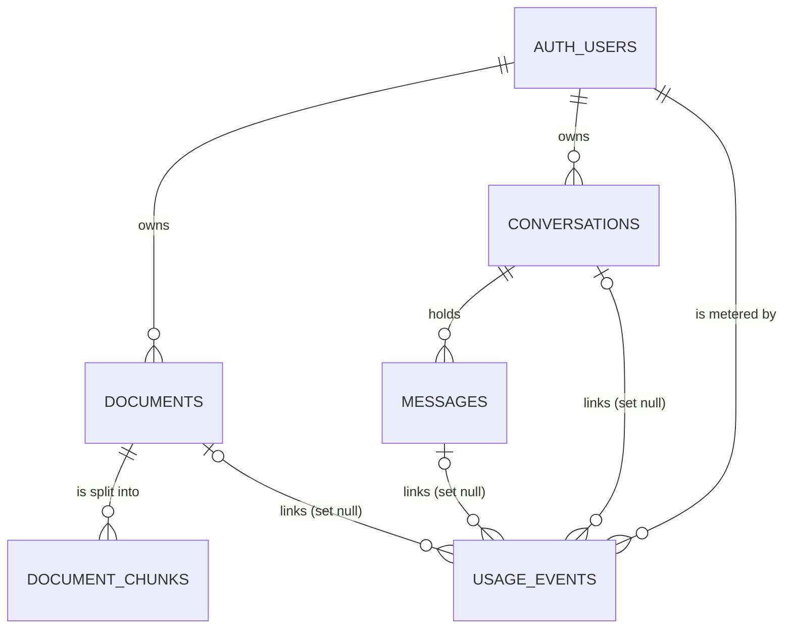
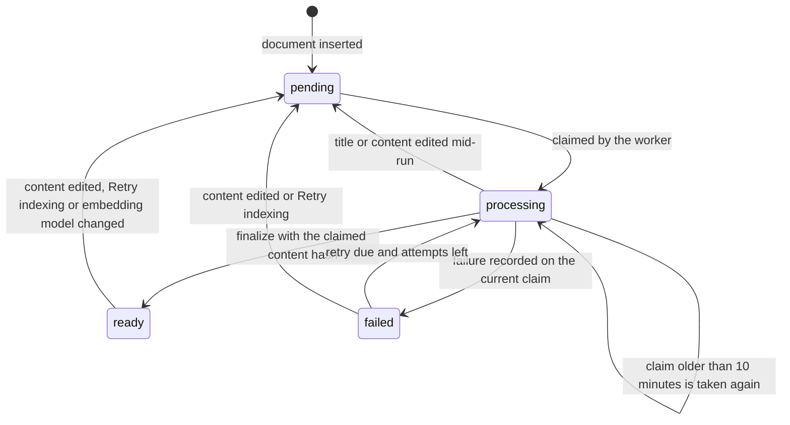

# Data Model: AI-Powered Knowledge Base

Everything lives in the `public` schema of the Supabase Postgres 17 database, created by the twelve migrations in [`supabase/migrations/`](../../supabase/migrations). The types the API compiles against are generated from it into `apps/api/src/database/database.types.ts`, and each repository's mapper turns rows into the contract DTOs of [`@kb/contracts`](../../packages/contracts/src). Every table is owned by one user, and row-level security decides visibility (DEC-004).

## Enumerations

| Type                      | Values                                     | Contract constant    |
| ------------------------- | ------------------------------------------ | -------------------- |
| `public.embedding_status` | `pending`, `processing`, `ready`, `failed` | `EMBEDDING_STATUSES` |
| `public.message_role`     | `user`, `assistant`                        | `MESSAGE_ROLES`      |
| `public.usage_kind`       | `chat`, `embedding`, `query_rewrite`       | `USAGE_KINDS`        |

`documents.source_type` is a checked `text` (`editor` or `upload`, contract `DOCUMENT_SOURCE_TYPES`), and `messages.finish_reason` is free `text` validated by the contract's `FINISH_REASONS` (`stop`, `length`, `content_filter`, `aborted`, `error`, `unknown`).

## 1. `documents`

| Column                  | Type                      | Rules                                                               |
| ----------------------- | ------------------------- | ------------------------------------------------------------------- |
| `id`                    | `uuid`                    | Primary key, `gen_random_uuid()`                                    |
| `user_id`               | `uuid`                    | Not null, default `auth.uid()`, references `auth.users` (cascade)   |
| `title`                 | `text`                    | Not null, 1 to 200 characters (`documents_title_length`)            |
| `content`               | `text`                    | Not null, at most 500,000 characters (`documents_content_length`)   |
| `tags`                  | `text[]`                  | Not null, default `{}`, at most 20 entries (`documents_tags_count`) |
| `source_type`           | `text`                    | Not null, default `editor`, `editor` or `upload`                    |
| `source_filename`       | `text`                    | Upload file name, else null                                         |
| `content_hash`          | `text`                    | Not null; SHA-256 of `title                                         |     | '\n' |     | content`, set by the trigger |
| `embedding_status`      | `public.embedding_status` | Not null, default `pending`: the queue state                        |
| `embedding_error`       | `text`                    | Last failure, at most 2,000 characters                              |
| `embedding_model`       | `text`                    | Signature of the published chunk set (`model` or `model#dims`)      |
| `chunk_count`           | `integer`                 | Not null, default 0; set by finalize                                |
| `ingestion_attempts`    | `integer`                 | Not null, default 0; incremented by every claim                     |
| `next_attempt_at`       | `timestamptz`             | Not null, default `now()`; `infinity` after a terminal failure      |
| `processing_started_at` | `timestamptz`             | Set while `processing`; drives stale-claim recovery                 |
| `created_at`            | `timestamptz`             | Not null, default `now()`                                           |
| `updated_at`            | `timestamptz`             | Not null, default `now()`; moved by the trigger on user edits       |

**Indexes**: `documents_user_updated_idx (user_id, updated_at desc)` for lists; `documents_tags_idx` GIN on `tags`; `documents_queue_idx (next_attempt_at) where embedding_status in ('pending', 'failed')`; `documents_processing_idx (processing_started_at) where embedding_status = 'processing'`; `documents_ready_model_idx (embedding_model) where embedding_status = 'ready'`.

**Trigger** `documents_before_write` (before insert or update): recomputes `content_hash`; on insert, or when the hash changes, resets the document to `pending` with no error, zero attempts, `next_attempt_at = now()` and no claim; moves `updated_at` when title, content or tags change. A tags-only edit therefore keeps the status, and a title edit re-indexes.

**Policies** (`to authenticated`): `documents_select_own`, `documents_insert_own`, `documents_update_own` and `documents_delete_own`, each on `user_id = (select auth.uid())` (`with check` on insert and update).

**Grants**: `authenticated` may `select` and `delete`, `insert (title, content, tags, source_type, source_filename)` and `update (title, content, tags)`. Every bookkeeping column is out of users' reach; `anon` has no privileges.

## 2. `document_summaries` (view)

`security_invoker = true`, so the `documents` policies apply to the caller. It exposes `id`, `user_id`, `title`, `left(content, 240) as content_preview`, `char_length(content) as content_length`, `tags`, `source_type`, `source_filename`, the status columns (`embedding_status`, `embedding_error`, `embedding_model`, `chunk_count`, `ingestion_attempts`, `next_attempt_at`) and the two timestamps: everything a list needs without `content`, `content_hash` or `processing_started_at`. `authenticated` may only `select` it.

## 3. `document_chunks`

| Column                  | Type                      | Rules                                                                                 |
| ----------------------- | ------------------------- | ------------------------------------------------------------------------------------- |
| `id`                    | `uuid`                    | Primary key                                                                           |
| `document_id`           | `uuid`                    | Not null, references `documents` (cascade)                                            |
| `user_id`               | `uuid`                    | Not null, references `auth.users` (cascade); copied from the document                 |
| `document_content_hash` | `text`                    | Not null; the document version the chunk was cut from                                 |
| `chunk_index`           | `integer`                 | Not null, at least 0; position in the document                                        |
| `content`               | `text`                    | Not null; the passage without its breadcrumb                                          |
| `heading_path`          | `text`                    | Not null, default `''`; the `Title › Heading` breadcrumb                              |
| `token_count`           | `integer`                 | Not null, at least 0 (cl100k)                                                         |
| `content_hash`          | `text`                    | Not null; SHA-256 of breadcrumb plus content, unique per document                     |
| `embedding`             | `extensions.vector(1536)` | Not null; shorter vectors are zero-padded (DEC-014)                                   |
| `embedding_model`       | `text`                    | Not null; embedding signature                                                         |
| `tsv`                   | `tsvector`                | Generated: `heading_path` weighted A plus `content` weighted B, English configuration |
| `created_at`            | `timestamptz`             | Not null, default `now()`                                                             |

**Constraint**: `document_chunks_document_hash_key unique (document_id, content_hash)`, the upsert key that makes re-indexing idempotent.

**Indexes**: `document_chunks_document_order_idx (document_id, chunk_index)`; `document_chunks_user_model_idx (user_id, embedding_model)` for the searches' filters; `document_chunks_embedding_idx` HNSW with `vector_cosine_ops`; `document_chunks_tsv_idx` GIN on `tsv`.

**Policy and grants**: `document_chunks_select_own`; `authenticated` may only `select`. Chunks are written by the worker through the service role.

## 4. `conversations`

| Column       | Type          | Rules                                                                          |
| ------------ | ------------- | ------------------------------------------------------------------------------ |
| `id`         | `uuid`        | Primary key                                                                    |
| `user_id`    | `uuid`        | Not null, default `auth.uid()`, references `auth.users` (cascade)              |
| `title`      | `text`        | Null until named; otherwise 1 to 120 characters (`conversations_title_length`) |
| `created_at` | `timestamptz` | Not null, default `now()`                                                      |
| `updated_at` | `timestamptz` | Not null, default `now()`; set on update and on every new message              |

**Index**: `conversations_user_updated_idx (user_id, updated_at desc)`. **Triggers**: `conversations_set_updated_at` (before update, `set_updated_at()`). **Policies**: select, insert, update and delete on own rows. **Grants**: `authenticated` may `select`, `insert`, `update` and `delete`.

## 5. `messages`

| Column              | Type                  | Rules                                                                     |
| ------------------- | --------------------- | ------------------------------------------------------------------------- |
| `id`                | `uuid`                | Primary key                                                               |
| `conversation_id`   | `uuid`                | Not null, references `conversations` (cascade)                            |
| `user_id`           | `uuid`                | Not null, default `auth.uid()`, references `auth.users` (cascade)         |
| `role`              | `public.message_role` | Not null                                                                  |
| `content`           | `text`                | Not null, at most 100,000 characters (answers included)                   |
| `citations`         | `jsonb`               | Not null, default `[]`, must be an array: the source snapshot (section 8) |
| `metadata`          | `jsonb`               | Not null, default `{}`, must be an object: retrieval and timing           |
| `provider`          | `text`                | Answers: the chat provider                                                |
| `model`             | `text`                | Answers: the chat model                                                   |
| `finish_reason`     | `text`                | Answers: why generation ended                                             |
| `prompt_tokens`     | `integer`             | Answers: prompt tokens                                                    |
| `completion_tokens` | `integer`             | Answers: completion tokens                                                |
| `usage_estimated`   | `boolean`             | Not null, default false; true when counted with cl100k                    |
| `created_at`        | `timestamptz`         | Not null, default `now()`                                                 |

**Index**: `messages_conversation_created_idx (conversation_id, created_at)`. **Trigger**: `messages_touch_conversation` (after insert) bumps the conversation's `updated_at`. **Policies**: `messages_select_own`; `messages_insert_own` also requires that the conversation belongs to the caller. **Grants**: `authenticated` may `select` and `insert` only; messages are immutable and disappear with their conversation.

## 6. `usage_events`

| Column              | Type                | Rules                                            |
| ------------------- | ------------------- | ------------------------------------------------ |
| `id`                | `uuid`              | Primary key                                      |
| `user_id`           | `uuid`              | Not null, references `auth.users` (cascade)      |
| `kind`              | `public.usage_kind` | Not null                                         |
| `provider`          | `text`              | Not null                                         |
| `model`             | `text`              | Not null                                         |
| `prompt_tokens`     | `integer`           | Not null, default 0, at least 0                  |
| `completion_tokens` | `integer`           | Not null, default 0, at least 0                  |
| `total_tokens`      | `integer`           | Not null, default 0, at least 0                  |
| `estimated`         | `boolean`           | Not null, default false                          |
| `latency_ms`        | `integer`           | Provider call duration                           |
| `conversation_id`   | `uuid`              | References `conversations`, `on delete set null` |
| `message_id`        | `uuid`              | References `messages`, `on delete set null`      |
| `document_id`       | `uuid`              | References `documents`, `on delete set null`     |
| `created_at`        | `timestamptz`       | Not null, default `now()`                        |

**Index**: `usage_events_user_created_idx (user_id, created_at desc)`. **Policy**: `usage_events_select_own`. **Grants**: `authenticated` may only `select`; the usage recorder inserts through the service role (DEC-020). Deleting a document or conversation keeps its usage and drops the link.

## 7. Privileges and functions

`20260929100800_grants_hardening.sql` states every privilege explicitly rather than relying on Supabase's defaults: `usage` on the schema for `anon`, `authenticated` and `service_role`; all table privileges for `service_role`; the per-table grants above for `authenticated`; and `TRUNCATE`, `REFERENCES`, `TRIGGER` and, on Postgres 17, `MAINTAIN` revoked from `authenticated` (`20260929100900_maintain_privilege.sql`). Every function sets `search_path = ''` and qualifies every object.

| Function                                                                                                              | Returns                                                 | Security                      | Executable by                   |
| --------------------------------------------------------------------------------------------------------------------- | ------------------------------------------------------- | ----------------------------- | ------------------------------- |
| `claim_pending_documents(p_batch_size 5, p_stale_after_minutes 10, p_max_attempts 5)`                                 | claimed rows (id, user, title, content, hash, attempts) | invoker                       | `service_role`                  |
| `upsert_document_chunks(p_document_id, p_content_hash, p_embedding_model, p_chunks jsonb)`                            | rows written, or -1 if the content changed              | invoker                       | `service_role`                  |
| `finalize_document_ingestion(p_document_id, p_content_hash, p_embedding_model, p_chunk_hashes text[])`                | chunk count, or -1 if the claim is gone                 | invoker                       | `service_role`                  |
| `mark_document_ingestion_failed(p_document_id, p_content_hash, p_attempt, p_error, p_retry_in_seconds)`               | nothing                                                 | invoker                       | `service_role`                  |
| `requeue_documents_for_model(p_embedding_model)`                                                                      | documents re-queued                                     | invoker                       | `service_role`                  |
| `requeue_documents(p_document_id default null)`                                                                       | documents re-queued                                     | definer, checks `auth.uid()`  | `authenticated`, `service_role` |
| `embedding_column_dimensions()`                                                                                       | the column's dimension (catalog read)                   | definer                       | `authenticated`, `service_role` |
| `match_chunks(p_query_embedding, p_embedding_model, p_match_count 20, p_min_similarity 0, p_document_ids, p_user_id)` | chunks with `similarity`                                | invoker (RLS applies)         | `authenticated`, `service_role` |
| `search_chunks_keyword(p_query_text, p_embedding_model, p_match_count 20, p_document_ids, p_user_id)`                 | chunks with `keyword_rank`                              | invoker (RLS applies)         | `authenticated`, `service_role` |
| `usage_summary(p_from now() - 30 days, p_to now(), p_timezone 'UTC')`                                                 | `jsonb` matching `usageSummarySchema`                   | invoker, filters `auth.uid()` | `authenticated`                 |

Rules the functions enforce:

- `claim_pending_documents` selects pending rows that are due, failed rows with attempts left that are due, and `processing` rows claimed more than `p_stale_after_minutes` ago, oldest `next_attempt_at` first, `for update skip locked`; it sets `processing`, stamps `processing_started_at`, increments `ingestion_attempts` and clears the error.
- `upsert_document_chunks` holds the document `for share` and returns -1 unless its `content_hash` still equals the claim's. A chunk sent with `embedding: null` copies the vector stored for the same hash and signature.
- `finalize_document_ingestion` locks the row, requires `processing` and the claimed hash, deletes every chunk of another content version, another signature or outside `p_chunk_hashes`, then sets `ready`, `chunk_count` and `embedding_model` (DEC-023).
- `mark_document_ingestion_failed` changes the row only while status, hash and attempt number still match the claim; `p_retry_in_seconds` null stores `next_attempt_at = infinity`, a terminal failure.
- `match_chunks` takes the `2 × p_match_count` nearest chunks by cosine distance among the caller's chunks with the given signature and optional document ids, keeps those whose `document_content_hash` equals the document's current hash and whose similarity meets the floor, and returns the top `p_match_count`. `search_chunks_keyword` ORs the query's English lexemes (falling back to `websearch_to_tsquery`), ranks with `ts_rank_cd` and applies the same filters (DEC-024).
- `usage_summary` returns `from`, `to`, `totals`, `byDay` (days in `p_timezone`) and `byModel` (ordered by total tokens) as one `jsonb` object.

## 8. Ingestion state machine

`documents.embedding_status` is the queue (DEC-005). Only the trigger and the functions above change it.

| Transition                           | Performed by                                                                                                        |
| ------------------------------------ | ------------------------------------------------------------------------------------------------------------------- |
| insert or content change → `pending` | `documents_before_write`, whenever `content_hash` changes                                                           |
| → `processing`                       | `claim_pending_documents` (batch 5, stale after 10 minutes, at most 5 attempts)                                     |
| `processing` → `ready`               | `finalize_document_ingestion`                                                                                       |
| `processing` → `failed`              | `mark_document_ingestion_failed`: retry after `max(30 s × 2^(attempt − 1) capped at 1,800 s, Retry-After)` or never |
| not `processing` → `pending`         | `requeue_documents` (Retry indexing, reindex-all), attempts reset                                                   |
| `ready` → `pending`                  | `requeue_documents_for_model`, once per API process, for another signature                                          |

A failed claim past `INGESTION_MAX_ATTEMPTS` (reachable only through the stale branch) fails for good before chunking, so a document that crashes the worker cannot loop (DEC-018).

## 9. Stored JSON shapes

**`messages.citations`**: an array of `Citation` (`citationSchema`), one per source in the prompt, in prompt order: `index` (1-based; `[n]` in the answer is `citations[n - 1]`), `documentId`, `documentTitle`, `chunkId`, `chunkIndex`, `headingPath`, `excerpt` (first 240 characters), `score` (RRF score in hybrid mode, cosine similarity in vector mode) and `cited`. Questions store `[]`.

**`messages.metadata`** on answers: `{ retrieval: { mode, query, rewrittenQuery, sourceCount, latencyMs }, timing: { firstTokenMs, totalMs } }`, where `query` is the question as asked and `rewrittenQuery` the standalone query that was searched instead, if any. It is not part of the public contract.

**`upsert_document_chunks.p_chunks`**: an array of `{ chunk_index, content, heading_path, token_count, content_hash, embedding }`, where `embedding` is the pgvector text literal `"[…]"` from `toStoredVector` (padded to 1536 values) or null to reuse the stored vector.

## 10. Rows to contracts

| Contract DTO                         | Source                                  | Mapper                                                        | Notes                                                                                                            |
| ------------------------------------ | --------------------------------------- | ------------------------------------------------------------- | ---------------------------------------------------------------------------------------------------------------- |
| `DocumentSummary`                    | `document_summaries`                    | `apps/api/src/modules/documents/documents.mapper.ts`          | `next_attempt_at = infinity` becomes `nextAttemptAt: null`; snake_case never leaves the repository               |
| `Document`                           | `documents`                             | same                                                          | adds `content`                                                                                                   |
| `Conversation`, `ConversationDetail` | `conversations`, `messages`             | `conversations.mapper.ts`, `messages.mapper.ts` (chat module) | answers get `model`, `finishReason` and `usage` (`promptTokens`, `completionTokens`, `totalTokens`, `estimated`) |
| `Citation`                           | retrieval results, `messages.citations` | `citations.mapper.ts` (from the prompt's sources)             | `messages.mapper.ts` validates stored snapshots with `citationSchema`                                            |
| `UsageSummary`                       | `usage_summary()`                       | `apps/api/src/modules/usage/usage.mapper.ts`                  | validated with `usageSummarySchema`                                                                              |
| `Readiness`                          | `embedding_column_dimensions()`         | `apps/api/src/modules/health/readiness.ts`                    | `mismatch` unless the column equals `VECTOR_DIMENSIONS` (1536)                                                   |

## 11. Migrations

| File                                        | Adds                                                                                                    |
| ------------------------------------------- | ------------------------------------------------------------------------------------------------------- |
| `20260929100000_extensions.sql`             | pgvector in the `extensions` schema                                                                     |
| `20260929100100_documents.sql`              | `embedding_status`, `documents`, its indexes, trigger, policies, column grants and `document_summaries` |
| `20260929100200_document_chunks.sql`        | `document_chunks` with the HNSW and GIN indexes, policy and grants                                      |
| `20260929100300_conversations_messages.sql` | `conversations`, `message_role`, `messages`, their triggers, policies and grants                        |
| `20260929100400_usage_events.sql`           | `usage_kind`, `usage_events`, policy and grants                                                         |
| `20260929100500_ingestion_functions.sql`    | the worker functions, `requeue_documents`, `embedding_column_dimensions` and their execute grants       |
| `20260929100600_search_functions.sql`       | `match_chunks`, `search_chunks_keyword` (first versions)                                                |
| `20260929100700_usage_functions.sql`        | `usage_summary`                                                                                         |
| `20260929100800_grants_hardening.sql`       | explicit privileges for every role                                                                      |
| `20260929100900_maintain_privilege.sql`     | revokes Postgres 17's `MAINTAIN` from `authenticated`                                                   |
| `20260929101000_ingestion_guards.sql`       | finalize with the run's chunk hashes; failures guarded by hash and attempt (DEC-023)                    |
| `20260929101100_search_consistency.sql`     | searches filter by content hash instead of status; keyword terms OR-ed (DEC-024)                        |
